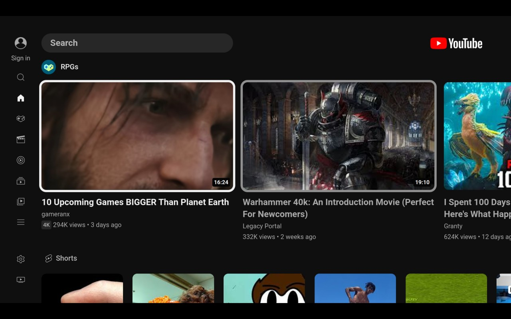

# YouTube Client (TV Interface)

A simple electron app that gives access to the YouTube TV interface similar to the AndroidTV App.



## Installation

### Linux

### Quick Install

Run the following in terminal:

```
curl -L https://github.com/aarron-lee/youtube-tv-linux/raw/main/install.sh | sh
```

### Steam Deck (Gaming Mode)

Run the Quick or Manual install first, then do the following:

- Enter Desktop Mode
- Open Steam, in the bottom left corner press the `Add a Game > Add a Non-Steam game`. Find the youtube tv app and add it
- Launch Game Mode
- Go to the YouTube TV non steam game
- Select Community Control Layout `YouTube TV Client`
- You can now launch the app and navigate with controller
- (Optional) Add artwork using `SteamGridDB`

#### Manual Install

- Download AppImage from releases
- Install the AppImage with your preferred AppImage manager, I'd recommend [GearLever](https://flathub.org/apps/it.mijorus.gearlever)

# Build from source

- Clone git repository
- Open the project folder in your IDE
- run `npm install`
- run `npm run build`
- Built app can be located at `./dist/`

## Credit

Icon: https://www.flaticon.com/free-icons/youtube
